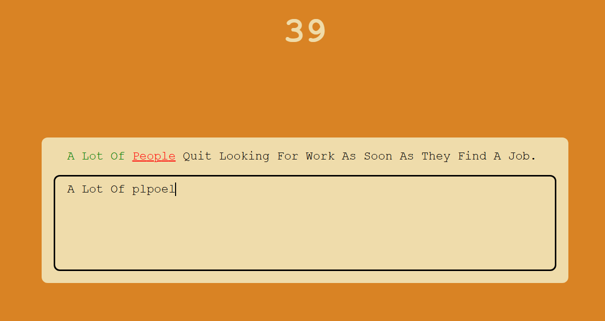

# Typing Practice App



Simple Typing practice app.

## Description

This is a simple typing practice tool that helps users improve their typing skills by visually indicating correct and incorrect keystrokes. As users type, the correct letters are highlighted in green, while incorrect ones appear in red. This tool provides immediate feedback, allowing users to focus on accuracy and gradually improve their typing precision. It does not track words per minute (WPM), but instead emphasizes the visual representation of correct and incorrect input, making it ideal for users who want to practice typing accuracy without the pressure of speed.

## Getting Started

### Dependencies

- A modern web browser (e.g., Google Chrome, Firefox, Edge)
- No special libraries or frameworks are required
- Operating system: Windows, Mac, or Linux

### Installing

1. Clone or download the repository to your local machine:

```sh
git clone https://github.com/Ashutosh-88/-Simple--Typing-Practicer
```

2. Navigate to the project folder in your terminal:

```sh
cd -Simple--Typing-Practicer
```

3. Open the `index.html` file in your web browser.

### Executing Program

1. To open the app, simply open the `index.html` file in your browser.
2. The timer begins as soon as the app is opened.
3. A random quote appears for you to type.
4. Input the quote, with correct characters highlighted in green and incorrect ones in red.
5. Once the quote is typed, a new one is automatically displayed and timer is reset to 0.
6. The process continues until this app is closed.

## Help

If you run into any issues, ensure you are using a compatible browser and that JavaScript is enabled. If you need more help, please check the browser console for any error messages.

## Authors

- [Ashutosh Tiwari](https://www.linkedin.com/in/ashutosh-tiwari-70b504190/)

## Version History

- 0.1
  - Initial Release

## License

This project is licensed under the [MIT License](https://opensource.org/licenses/MIT) - see the LICENSE.md file for details.

## Acknowledgments

Inspiration :

- [@WebDevSimplified](https://www.youtube.com/@WebDevSimplified)
